# How to use the Transpose window

This repo contains an explanation of how to use the Transpose window and a few examples to illustrate.

## Table of Contents

* [Transposing data from long to wide](#transposing-data-from-long-to-wide)
	* [Source Window Configuration](#source-window-configuration)
	* [Transpose Window Long to Wide Configuration](#transpose-window-long-to-wide-configuration)
	* [Run Project and Load Data](#run-project-and-load-data)
* [Transposing Data from Wide to Long](#transposing-data-from-wide-to-long)
	* [Source Window Configuration](#source-window-configuration)
	* [Transpose Window Wide to Long Configuration](#transpose-window-wide-to-long-configuration)
	* [Run Project and Load Data](#run-project-and-load-data)

## Transposing data from long to wide

Let's say our input data looks like this:

Tag Name | Value | Units | Event Time | Sequence
----|-------|-------|------------|---------
temperature | 100.0 | F | 12:00 | 0
pressure | 50.0 | Pa | 12:00 | 1
volume | 3.5 | cbm | 12:00 | 2
depth | 45 | m | 12:00 | 3
temperature | 101.0 | F | 12:01 | 4
pressure | 51.0 | Pa | 12:01 | 5
volume | 3.6 | cbm | 12:01 | 6
temperature | 102.0 | F | 12:02 | 7

And we want to transpose it so that it looks like this:

Sequence | Event Time | Temperature Value | Temperature Units | Pressure Value | Pressure Units | Volume Value | Volume Units
---------|------------|-------------------|-------------------|----------------|----------------|--------------|-------------
0 | 12:00 | 100.0 | F | | | |
1 | 12:00 | 100.0 | F | 50.0 | Pa | | 
2 | 12:00 | 100.0 | F | 50.0 | Pa | 3.5 | cbm
4 | 12:01 | 101.0 | F | | | | 
5 | 12:01 | 101.0 | F | 51.0 | Pa | | 
6 | 12:01 | 101.0 | F | 51.0 | Pa | 3.6 | cbm
7 | 12:02 | 102.0 | F | | | |

Before we get into how to accomplish this, let's understand what we're looking at. The input data has 4 tags: temperature, pressure, volume, and depth. We want to ignore 'depth' and create a wide record for each set of temperature, pressure, and volume readings that have the same event time.

Look at the transposed data. Notice how the transposed records are built one event at a time. We have to remember that, unlike programs running on batches of data, SAS Event Stream Processing windows process one event at a time. So, in the transpose window, a new event is produced every time it receives an event, as long as it conforms to what we specify in the configuration of the transpose window. Let's see how to do this in the ESP Studio.

 If you don't already have access to the SAS Event Stream Processing Studio, follow the directions [here](https://www.sas.com/en_us/trials.html) to gain access to the ESP Trial Environment.

### Source Window Configuration

1. Open up the ESP Studio, and create a new project and call it 'transpose_long_to_wide'.

2. On the left side of the screen, expand the 'Input Streams' tab and click and drag a Source window into the canvas area in the middle of the screen.

3. Select the Source window by clicking on the object you just dragged into the canvas area. Now go to the right side of the screen and expand the 'State and Event Type' tab. Check the box 'Accept only "Insert" events' and then check the box 'Automatically generate the key field'. This is because, in this case, our data doesn't come with a key field.

4. Go to the very right side of the screen and click on the button as shown, and create this schema: 

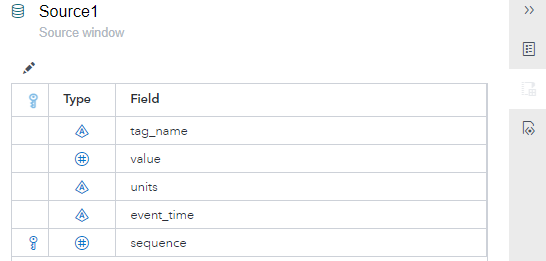

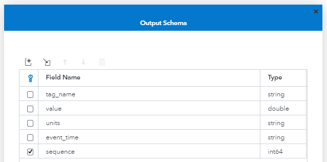

### Transpose Window Long to Wide Configuration

Now that the source window is set up, go back to the left side of the screen and expand the 'Transformations' tab. Click and drag a Transpose window into the canvas area, and connect it to the source window. Click on the Transpose window to select it, and from here we will configure the Transpose window using the steps below.

1. Open up the "Settings" tab

2. For mode, select "Wide"

3. "Tag name" is required and is a dropdown menu, which contains a list of the fields from the previous window. We want to select the field that contains the names that will be column names after the data is transposed. In our case, the field is called "tag_name" but it could be called anything.

4. "Included tags" is required and the user must manually enter the names of the tags to be involved in the transposing. In our case, those tag names are: temperature, pressure, and volume. Click the text box under "Included tags" and hit enter after typing in each tag name. Note: if there are tags in the input data that are not on this list, they will not make it into the Transpose window.

5. "Tag values" is required and when you click in the box, you're presented with a list of fields. This list will contain all fields from the previous window, except the one you have specified in step 3, and any fields you are grouping by (which will be discussed in step 7). We can select any number of the available fields, except for the key field, and these are the values that go along with the tag name field specified in step 3. Choose "value" and "units". The field names in the transpose window will be a concatenation of whatever was entered in step 3 with whatever tag values were chosen in this step, with an underscore in between. So, in our example, we would expect to see fields named 'temperature_value', 'temperature_units', 'pressure_value', and so on.

6. "Clear time-out" has two choices, and "Never" is the default. When "Never" is selected, it doesn't matter how much time elapses between events coming in. If "Time-out" is selected, events will only be part of the same wide record as long as they all come in within this duration. For example, let's select "Time-out" with a 5 second interval. If the first two events come in to the Transpose window at roughly the same time, but the third comes in 10 seconds later, the third event will be part of a separate transposed event.

7. "Group by" is optional and the user must manually enter the names of the fields to be grouped by. For example, in our case, we group by "event_time". This means that only events with the same "event_time" will be part of a single transposed event.

If done correctly, the properties panel of the Transpose window should look like this:

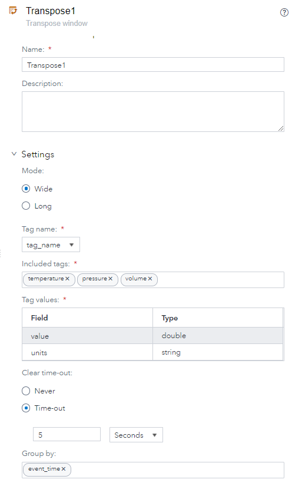

### Run Project and Load Data

1. Copy the data in 'long_to_wide.csv' from [here](https://github.com/sassoftware/iot-transpose-window/blob/main/files/long_to_wide.csv) to a local file. 

2. By this point, everything should be in place and ready to run. Make sure there are no spelling mistakes in the  field names in the two windows. Save the project by clicking on the disk icon, click 'Enter Test Mode' and then 'Run Test'. If the steps above have been followed correctly, there should be no errors and the project should be in a running state with no data present in the system.

3. Click the 'Publish' button at the top of the screen, and you should see this window pop up:

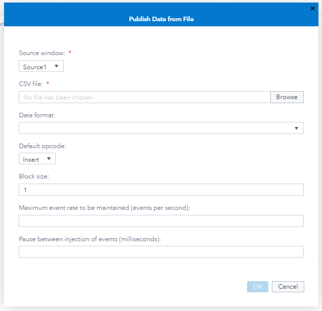

4. Click 'Browse' and select 'long_to_wide.csv' from your download location, then hit 'ok'. This will cause that data to stream into the Source window, and here is what we expect to see in the Source and Transpose windows:

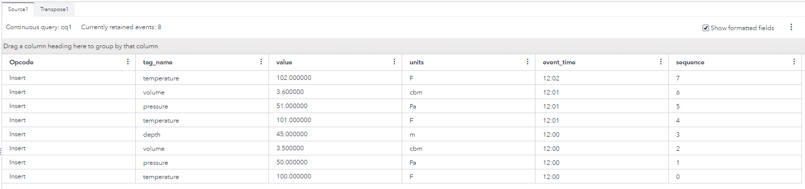

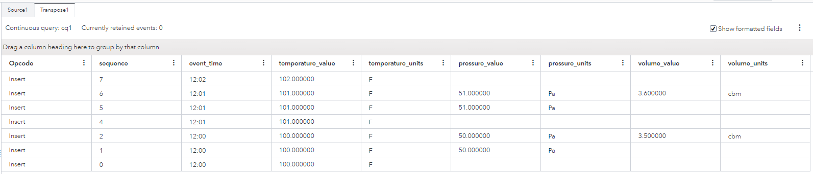

## Transposing Data from Wide to Long

Let's say our input data looks like this:

Event Time | Temperature Value | Temperature Units | Pressure Value | Pressure Units | Volume Value | Volume Units | Depth Value | Depth Units | Sequence
-----------|-------------------|-------------------|----------------|----------------|--------------|--------------|-------------|-------------|--------
12:00 | 100.0 | F | 50.0 | Pa | 3.5 | cbm | 200 | m | 0
12:01 | 101.0 | F | 51.0 | Pa | 4.5 | cbm | 201 | m | 1
12:02 | 102.0 | F | 52.0 | Pa | 5.5 | cbm | 202 | m | 2

And we want to transpose it into a long form, in which each transposed event contains the tag, value, and event time. Let's say that we want to leave out the 'depth' fields, and only transpose the others. The output we are expecting from ESP is this:

Sequence | Tag Num | Tag | Value | Units | Event Time
---------|---------|-----|-------|-------|-----------
0 | 0 | temperature | 100.0 | F | 12:00
0 | 1 | pressure | 50.0 | Pa | 12:00
0 | 2 | volume | 3.5 | cbm | 12:00
1 | 0 | temperature | 101.0 | F | 12:01
1 | 1 | pressure | 51.0 | Pa | 12:01
1 | 2 | volume | 4.5 | cbm | 12:01
2 | 0 | temperature | 102.0 | F | 12:02
2 | 1 | pressure | 52.0 | Pa | 12:02
2 | 2 | volume | 5.5 | cbm | 12:02

Let's see how to do this in the ESP Studio.

### Source Window Configuration

1. Open up the ESP Studio, and create a new project and call it 'transpose_wide_to_long'. 

2. On the left side of the screen, expand the 'Input Streams' tab and click and drag a Source window into the canvas area in the middle of the screen.

3. Select the Source window by clicking on the object you just dragged into the canvas area. Now go to the right side of the screen and expand the 'State and Event Type' tab. Check the box 'Accept only "Insert" events' and then check the box 'Automatically generate the key field'. This is because, in this case, our data doesn't come with a key field.

4. Go to the very right side of the screen and click on the button as shown, and create this schema:

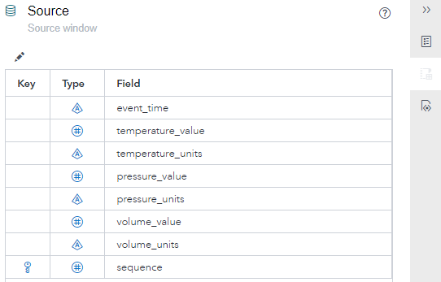

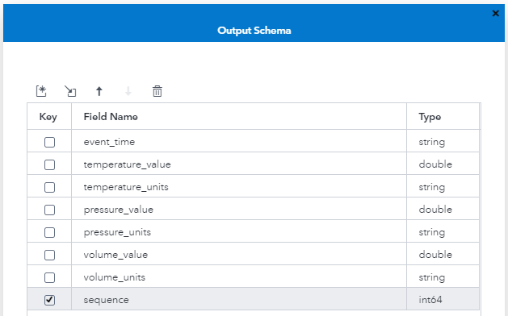

### Transpose Window Wide to Long Configuration

Now that the source window is set up, go back to the left side of the screen and expand the 'Transformations' tab. Click and drag a Transpose window into the canvas area, and connect it to the source window. Click on the Transpose window to select it, and from here we will configure the Transpose window using the steps below.

1. Open up the "Settings" tab

2. For mode, select "Long"

3. "Tag name" is required, and this will become the name of the column in the Transpose window which will contain the tag names. In our case, enter "tag" in the box.

4. "Included values" is required, and for our example, type "value" and hit enter, and then "units" and hit enter, but don't include the quotes. The best way to understand what is happening in this step is with an example. Our Source window fields included names like: pressure_value, pressure_units, volume_value, etc. When we choose "value" and "units" as our Included values, ESP looks at the schema of the window just before the Transpose window, and expects there to be fields that look like this: xxxx_value, and xxxx_units. The "xxxx" will be the names that become the Tag names from the above step, and "value" and "units" will become field names in the Transpose window. A final, but very important, note about this item is that there **_must_** be an underscore between the "xxxx" and whatever Included values we choose. For example: temperaturevalue, and temp_eraturevalue will not work as a field name that the Transpose window can process, because there is no underscore immediately preceeding "value". A Source window field name like "temp_1_value" would work, since there is an underscore immediately preceeding "value". 

5. "Included tags" is required, and for our example, type "temperature" and hit enter, then "pressure" and hit enter, and then "volume" and hit enter, but don't include the quotes. This works in much the same way as the previous step. In this case, we need to enter the "xxxx" from the above step, which may include underscores. In our example, we are using all the tag names except "depth".

If done correctly, the properties panel of the Transpose window should look like this:

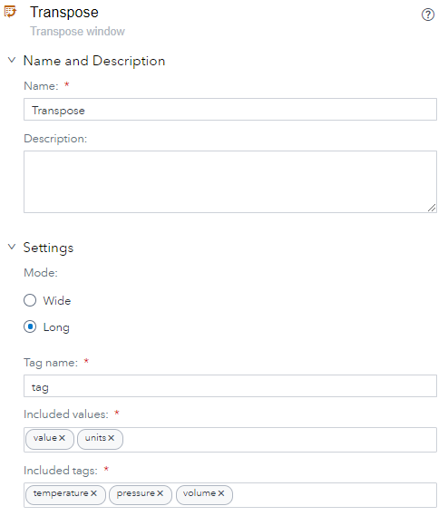

An additional note about transposing data from wide to long, is that the Transpose window creates an extra field in its output, called "tagNum". This will automatically be a key field, and it is generated to ensure that all transposed events have a unique set of keys. In the case of transposing long to wide, recall that we had 1 output event for each input event that met our criteria. We don't need an additional key field in that case, because the field "sequence" already serves as a key. In this case, however, we have 1 input event generating 3 output events in the Transpose window. We can no longer have only "sequence" as a key field, since each group of three events will have the same sequence number. ESP prevents this from being a problem by introducing a the field "tagNum" which will enumerate, starting at zero, each event that comes from a single wide record. If this doesn't quite make sense, see the output when you've run the project.

### Run Project and Load Data

1. Copy the data in 'wide_to_long.csv' from [here](https://github.com/sassoftware/iot-transpose-window/blob/main/files/wide_to_long.csv) to a local file. 

2. By this point, everything should be in place and ready to run. Make sure there are no spelling mistakes in the field names in the two windows. Save the project by clicking on the disk icon, click 'Enter Test Mode' and then 'Run Test'. If the steps above have been followed correctly, there should be no errors and the project should be in a running state with no data present in the system.

3. Click the 'Publish' button at the top of the screen, and you should see this window pop up:

4. Click 'Browse' and select 'wide_to_long.csv' from your download location, then hit 'ok'. This will cause that data to stream into the Source window, and here is what we expect to see in the Source and Transpose windows:

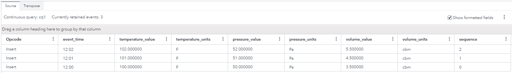

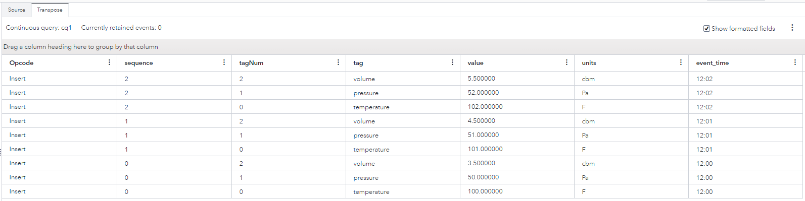
