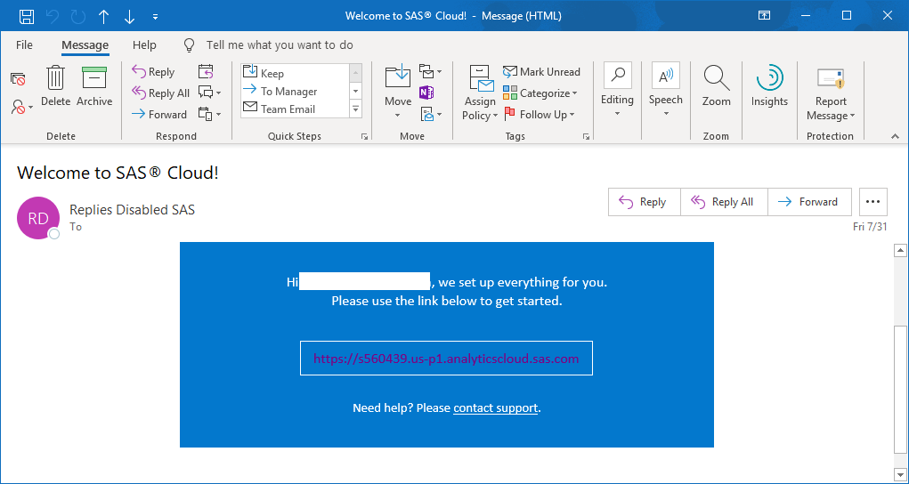
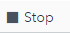

# Using the SAS Event Stream Processing Trial Environment

## Table of Contents

[[_TOC_]]

## Register for Free Trial

1. Go to the [SAS Event Stream Processing](https://www.sas.com/en_us/software/event-stream-processing.html) home page.

2.	Click **Get Free Trial**.

3.	Follow the instructions…

## Log onto Trial Environment

Once registered, you will receive an e-mail message with a link to your environment in the SAS Cloud.

*Figure 1 - SAS Cloud E-mail Message*

Click the provided link and proceed to log onto the environment.

## Access SAS ESP Studio

1.	On the left side of the SAS Cloud screen, click **Apps**.
    *The Applications screen appears.*

2.	Click **SAS Event Stream Processing**.
    *The Choose Interface screen appears.*

3.	Click **SAS ESP Studio** to start the application.

## Building and Running a Project in SAS ESP Studio

SAS ESP Studio allows you to test a project.

1.	Ensure the project is open in SAS ESP Studio.

2.	If necessary, click  to save your changes. A project must be saved before it can be tested.

3.	Click  to open the Test window.
	        
4.	Click  to begin the test. The project will start on the server and any connectors will begin publishing and subscribing. In this example, we are not using connectors, but rather publishing data directly from the studio according to the instructions [here](https://gitlab.sas.com/IOT/tutorials/ESP-tutorials/how-to-use-the-transpose-window#run-project-and-load-data)
   
5.	Once the project is running, and data has been published into ESP, click any of the tabs to view the output from the various windows.

6.	To stop the test, click .

## Enable Logging on the SAS ESP Server

If you receive an error or the connectors cannot start when you test a project, you can enable logging on the SAS ESP Server to view the messages from the log.

1.	Click **ESP Servers** to display the ESP Servers screen.

2.	Click the ESP Trial Server entry to select it, and then click  to open the properties for the server.

3.	Click **Enable logging on the ESP server** and then click **OK**.

4.	Run the test again with logging enabled.
